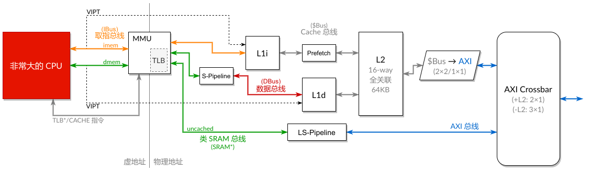

# Cache



## 文件结构

* `assets/`：非源码的资源文件。
* `build/`：构建测试时的临时文件夹。
* `src/`：源代码。
    * `include/`：SystemVerilog 头文件。
    * `ip/`：Vivado 中用到 IP 核的配置文件（`.xci`）。
    * `ram/`：RAM 相关的基础模块。
    * `synth/`：用于单独进行 Vivado 综合和布线的模块代码。
    * `top/`：存放 `mycpu_top.sv`。
    * `util/`：辅助模块、总线转接模块。
    * `xsim/`：Vivado 下的测试源码。
* `test/`：测试代码。
* `trace/`：保存波形图的文件夹。默认不上传波形图文件（`.fst` 和 `.vcd`），只上传 GTKWave 的配置文件（`.gtkw`）。
* `.gitignore`
* `Makefile`：使用 `make run` 运行测试。
* `README.md`：本文件。
* `sources.tcl`：用于加入 cache 源码的 Tcl 脚本。
* `sources-cache.tcl`：在 `sources.tcl` 的基础上加入文件 `xsim/global.svh`。
* `wrap.py`：顶层模块生成器。用于测试。

## 模块测试

部分需要与 IP 核交互的模块是在 Vivado 上测试的，测试代码在 `src/xsim` 中。另外一些代码会先使用 Verilator 进行仿真测试。运行这些仿真测试只需要使用以下命令：

```shell
make run top=[顶层模块名称]
```

这里要求 `$(top).sv` 在 `src/` 目录下，并且编写了对应的 `$(top).cpp` 测试源码，放置于 `test/` 目录下。

编译宏：

* `RUN_ALL`：是否不跳过被 `SKIP` 标记的测试。
* `FAST_SIMULATION`：编译时开启 O2 优化，并且取消 `-fsanitize=undefined`。

在跑正式测试时建议使用 `RUN_ALL=1 FAST_SIMULATION=1`。

可以使用 `make all` 来运行所有在 `test/` 目录下的测试。

## Cache 配置

ICache 和 DCache 的配置参数参见 `cache.svh` 文件。

## 命名逻辑

所有 master → slave 的请求以 `req` 进行标注，而 slave → master 的反馈以 `resp` 进行标注。例如，`axi_req_t` 和 `axi_resp_t`。

对于总线的转接模块 `XBusToYBus`，`XBus` 表示从 master 一端过来的总线类型，`YBus` 表示 slave 一端的总线类型。例如，`SRAMxToInstrBus` 表示把 CPU 出来的 SRAM* 总线转为 IBus 总线。

## Cache 总线（`cbus`/$bus）

Cache 总线用于 cache 读取/写回一整条 cache line。在时钟上升沿时进行握手。该总线不是双向握手，cache（master）一方必须进行忙等待，slave 一方的 `okay` 和 `last` 信号只持续一拍。

方向 “`→`” 表示 master 到 slave 的信号，“`←`” 表示 slave 到 master 的信号。

参数：

* `DATA_WIDTH`：读/写的数据宽度（`CBUS_DATA_WIDTH`）。
* `LEN_BITS`：最大读/写长度减一所需的位数（`CBUS_LEN_BITS`）。

信号：

* `valid`：`→`。是否发出请求。
* `is_write`：`→`。本次请求是否是写请求。
* `addr[31:0]`：`→`。读/写的初始地址。
* `order[LEN_BITS - 1:0]`：`→`。阶数。用于计算连续读/写的次数。要求 cache line 的大小必须是 2 的幂次，因此次数为 2<sup>order</sup>。
    * 中阶任务中的 AXI 总线单次 burst 传输只能传 16 个。因此转接时可能需要多次传输。
* `wdata[DATA_WIDTH - 1:0]`：`→`。单次写入的数据。
* `rdata[DATA_WIDTH - 1:0]`：`←`。单次读出的数据。
* `okay`：`←`。单次读取/写入是否成功。
* `last`：`←`。本次数据传输是否完成。

Master 需要读写时，只用准备好 `is_write`、`addr` 和 `order`，然后全程拉起 `valid` 信号。之后等待 slave 反馈 `okay` 信息。每次收到 `okay` 时，如果是读取，则 `rdata` 是读取到的数据；如果是写入，则 `wdata` 应换上下一个要写入的数据。读/写都是顺序读写。当 slave 返回 `last` 时，表明操作已经完成，此时可以撤去 `valid` 信号。该总线要求在 `valid` 等于 1 的时候，`is_write`、`addr` 和 `order` 不能改变；在 slave 反馈 `last` 前，`valid` 不能撤下。

$bus 并没有规定 AXI burst 传输的类型，也没有规定 `addr` 是否需要和 cache line 的大小对齐。可以根据需要选择 `INCR` 类型或者 `WRAP` 类型。

## 类 SRAM 总线（`sramx`/`SRAMx`/SRAM*）

参考 “`A12_类SRAM接口说明.pdf`” 中的规定。

关于握手信号的规定：

* Slave 可以无视 master 的 `req` 信号而拉起 `addr_ok`，表示 slave 当前随时可以接收新的请求。
* Slave 需要保证只在必要的时候拉起 `data_ok`，表示之前收到的请求处理完成。当 slave 当前没有处理任何请求时，不能拉起 `data_ok`，即便 master 的 `req` 信号没有拉起。
* 对于同一个周期的请求，`addr_ok` 和 `data_ok` 可以同时为 1，表示数据可以在当前周期准备好（读取）或者是在下一个时钟上升沿更新（写入）。
* 如果 slave 支持同时接收多个请求，则按照文档中关于处理连续读写的要求来。

## 取指总线（`ibus`/IBus）

NOTE：不是指输入法框架（Fcitx 大法好

IBus 对 SRAM* 总线接口做了简化。取指只需要发出请求信号 `req` 和地址 `addr`。原则上在 cache 未返回 `addr_ok` 的时候不能撤下 `req`。但部分情况下提前撤下可能不会有问题。

参数：

* `IBUS_DATA_WIDTH`：IBus 一次取指的宽度。如果是双发射，则为 64。以此类推，4 发射就是 128。
* `IBUS_WORD_WIDTH`：指令的宽度。一般固定为 32。

信号：

* `req`：`→`。表示是否有读取请求。
* `addr`：`→`。请求的地址（PC）。要求和指令宽度对齐。
* `addr_ok`：`←`。表示地址是否被 cache 接收（例如通过了 cache 的第一级流水线阶段）。`addr_ok` 握手成功后可以撤下 `req` 信号。
* `data_ok`：`←`。表示数据是否准备好。
* `data`：`←`。抓取到的数据。与 `index` 之间需要配合使用。
* `index`：`←`。`data` 相当于是一个指令的数组，而 `index` 指示这个数组中第一条有效的数据（指令）的下标。例如，如果 `index` 为 0，则表示 `data` 中的所有指令都是有效的。如果是双发射，而且 `index` 为 1，则表示此时只有第二条指令是有效的。

在目录 `cache/util/` 下我们提供了一个 IBus 总线转接 SRAM* 总线的转接模块 `InstrBusToSRAMx`，用于在没有接入真正的 cache 时，测试与 IBus 的交互。

## 数据总线（`dbus`/DBus）

数据总线和 SRAM* 总线相比，只是处理 SRAM* 中 `size` 和 `addr` 组合的信息，生成一个 `write_en`。

**注意**：在 DBus 中，即使 `is_write` 为 0，此时依然要求 `write_en` 为全 0。

参数：

* `DBUS_DATA_WIDTH`：数据宽度。一般和 SRAM* 保持一致。

信号：

* `valid`：`→`。当前周期是否发出请求。
* `is_write`：`→`。当前周期的请求是否为写请求。
* `write_en`：`→`。字节写使能。要求当 `is_write` 为 0 时，写使能必须为全 0。
* `addr`：`→`。读/写地址。
* `req.data`：`→`。写操作的写入数据。
* `addr_ok`：`←`。地址是否被接收。
* `data_ok`：`←`。数据是否准备/写入完成。
* `resp.data`：`←`。读取到的数据。

## `mycpu_top`

Cache 部分只会修改 CPU 顶层模块的代码。代码位于 `code/mycpu_top.sv`。一般情况下大部分修改都在 `CacheLayer` 里面。

参数：

* `USE_CACHE`：是否使用 cache layer。如果为 0 则 CPU 需要自己做地址翻译。
* `USE_ICACHE`：是否使用 ICache。如果为 0 则使用 `OneLineBuffer`。
* `USE_DCACHE`：是否使用 DCache。如果为 0 则使用 `OneLineBuffer`。
* `USE_IBUS`：是否使用 IBus 。如果为 0 则会在 ICache 前接一个 `SRAMxToInstrBus` 的转接模块。

对 `mycpu` 而言，需要根据需要使用 `inst_*`、`data_*` 或者是 `inst_ibus_*` 这些信号。

## 地址翻译模块（`TranslationUnit`/TU）

代码中将地址翻译模块独立了出来，写在了 `TranslationUnit` 模块内部，简称为 TU。默认的 TU 是没有实现 TLB 的。现在 TU 提供的接口如下：

* `clk`：CPU 的时钟信号。
* `resetn`：CPU 的 reset 信号。
* `i_req`/`i_resp`：指令访问地址翻译请求。结构体的定义请参见 `src/include/tu_addr.svh`。
* `d_req`/`d_resp`：数据访问地址翻译请求。同上。
* `op_req`/`op_resp`：预留给 CPU 和 TU 间交互的通道。目前在 `src/include/tu.svh` 中没有写入详细的定义。

`tu_addr_req_t` 和 `tu_addr_resp_t` 是地址翻译请求的结构体类型，其定义在 `src/include/tu_addr.svh` 中。这两个类型是与 MMU 部分交互的，一般不需要做修改。而 `tu_op_req_t` 和 `tu_op_resp_t` 是和 CPU 交互的接口结构体类型，其定义在 `src/include/tu.svh` 中，需要根据实际需求来增减信号。

如果 CPU 需要和 TU 进行沟通，则要在 `mycpu` 模块的接口中添加 `tu_op_req` 和 `tu_op_resp` 这两个接口，类型分别为 `tu_op_req_t` 和 `tu_op_resp_t`。

如果需要替换掉 cache 内部实现的默认 TU，可以将 `src/include/disable_tu.svh` 在 Vivado 中设置为全局包含（global include），或者在全局定义宏 `DISABLE_DEFAULT_TU`。设置后，`tu_op_req_t`、`tu_op_resp_t` 和 `TranslationUnit` 将不在 cache 的代码中定义。之后需要有其它地方提供头文件 `tu.svh` 和 `TranslationUnit` 这个模块。

地址翻译请求信号：

* `req`：`→`。表示当前周期是否有请求。没有地址翻译的情况包括 CPU 没有发送访存请求、`cache` 指令的请求。
* `vaddr`：`→`。需要翻译的虚拟地址。
* `paddr`：`←`。翻译后的物理地址。
* `is_uncached`：`←`。指示该地址的访问是否不经过 cache。