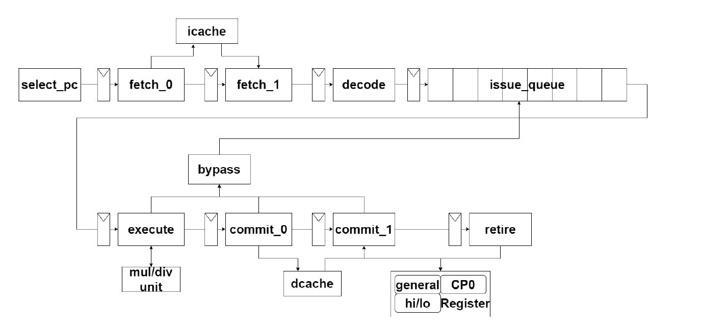
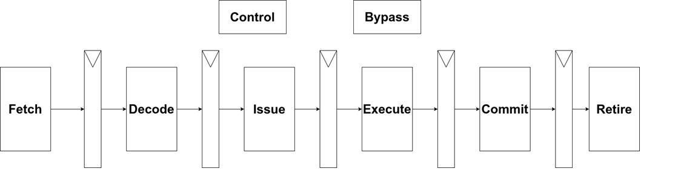
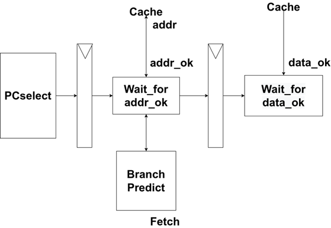
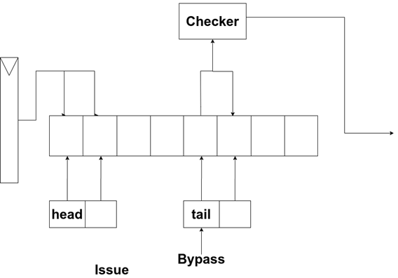
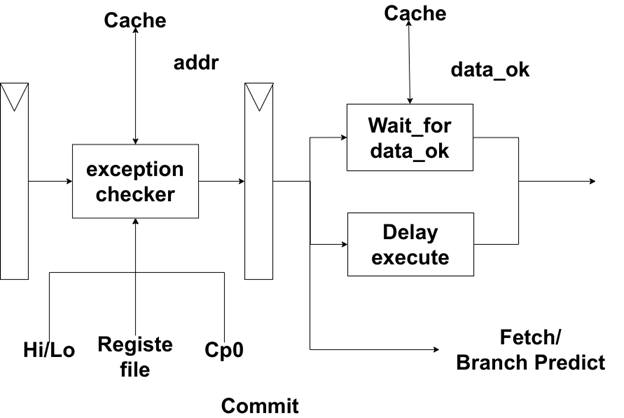

# CPU主体部分

## 概述

我们**一个朴素的双发射MIPS处理器**的CPU主体部分采用了八级流水设计，为顺序双发射。

各流水线阶段分别为：Fetch取指阶段、Decode译码阶段、Issue发射阶段、Execute执行阶段、Commit提交阶段、Retire退休阶段，其中Fetch取指阶段与Commit执行阶段为两级流水。

## 文件结构

* `assets/`：非源码的资源文件。
* `bpb/`：分支预测模块。
* `commit/`：Commit阶段的代码。
* `fetch/`：Fetch阶段的代码。
* `mult/`：乘除法器的代码。
* `sbuffer/`：写缓冲的代码。
* `top/`：使双发射处理器适配测试文件每拍最多比对1行trace的特点。
* `source.tcl`：快速添加源文件的tcl脚本。
* 其他代码：流水线其他部分的代码。

以下为报告的流水线设计部分，我们把报告中的内容与具体的`systemverilog`源文件结合起来描述，希望能有一个更好的效果。

------

## 流水线设计

### 取指阶段

#### 取指的两级设计

CPU的指令Cache设计为两级流水，其特点为：在第i个时钟周期接收到地址，如果命中，会在第i+1个时钟周期返回数据。如果取指设计为一级流水，每次请求即使命中，也必须暂停一个周期。

为配合两级流水线的指令Cache，取指阶段也设计为两级流水，在第一级流水发出请求信号与地址，在第二级流水接收数据，这样在Cache命中时流水线无需暂停了，相较一级流水的取指大大提升了效率。主体代码为`fetch/quickfetch.sv`。

当遇到取指的暂停、跳转信号，或者当遇到分支预测的跳转时，由于icache部分不能对一个已经发出address ok的请求进行暂停、清除，该处理器对两级流水又分别添加了一个valid位，从而进行相关的控制。

1. 对于跳转信号，把两级流水的valid置为0。

2. 对于暂停信号，把两级流水的valid置为0。

3. 对于分支预测的跳转信号，把两级流水的第一级流水的valid置为0。

这部分的控制代码见`fetch/quickfetch.sv`的`94~138`行。

在第二级流水进行输出时，如此时流水的valid信号为0，那么会将输出清空。在第一级流水新pc的选择上，会先后和跳转信号、暂停信号、分支预测信号进行比对，若有信号为1则选择相应的值作为新的pc。

#### 分支预测

对于branch类指令该处理器的分支预测包含了64个入口，把指令地址第[7:2]位上的数值作为入口的编号，使用普通的2-bit状态机进行分支预测的处理。目录`bpb/`中的branch predictor buffer有三个版本，对应三个不同的策略，我们最终采用的是`bpb0.sv`。

对于j、jal指令，该处理器会直接选择跳转。

对于jr指令，该处理器使用了一个最大容量为16的栈来存储所有jal、bal指令的pc+8的值，每次jr指令都会把栈顶元素作为jr的目标跳转位置。代码见`bpb/jrstack.sv`和`bpb/jrpredict.sv`

### 译码阶段

译码阶段接收Fetch阶段寄存器传来的指令进行译码，并生成一系列控制信号。

译码阶段的代码为`decode.sv`和`maindecode.sv`。同时，我们把指令编码用宏定义的形式列举在了`mips.svh`的`41~112`行，控制信号全体定义在了`mips.svh`的`139~160`行，这种写法方便后续添加指令与控制信号。

### 发射阶段

发射阶段实现了一个四端口（两个连续的读端口，两个连续的写端口）的队列。队列的两个指针分别指向第一个读端口和第一个写端口的下标。该队列的读写逻辑为先读后写，这样就避免了当读写指针有重叠时某条指令会加入队列后直接弹出的情况。详见`issue.sv`。

对于写端口下标指向的两条指令，处理器会使用以下规则来进行发射一条还是两条指令的判断：

1. 第一条或第二条有源操作数未完成。若第一条未完成，两条都不能发射；若第二条未完成，第二条不能发射。

2. 第二条指令对第一条指令有数据依赖关系，若存在，则第二条指令不能发射。

3. 第一条指令和第二条是否都会用到乘除法器，若都会用到，则第二条指令不能发射。

4. 第一条指令和第二条是否都是访存指令，若都是，则第二条指令不能发射。

5. TLB、cache、特权指令只能单独发射。

6. 有跳转类型的指令时，即使延迟槽为4类指令，要求延迟槽和跳转指令同时发射。若有1类情况，则不能发射。若第二条会用到第一条指令的寄存器（ra），则在发射阶段进行特判。

第二条指令的发射使能在`issue.sv`的`263~279`行描述。

### 执行阶段

执行阶段使用了两个ALU分别处理两条指令对运算的请求（见`execute.sv`，execute模块里例化了两个FU）。由于乘除法器件的资源占用较多，该处理器只使用了一个乘除法器件，两条指令需要共用这个器件。这也导致了不能同时发射两条使用乘除法器的指令。

乘法器采用了IP核；除法器为自己设计的，算法为Radix-4，相对IP核节省了一些板上资源。除法器的设计详见`mult/divider.sv`和`mult/divider.svh`。

|                | Mode             | Algorithm | LUTs  | FFs       |
| :------------- | ---------------- | --------- | ----- | --------- |
| Xilinx IP core | 32-bits Unsigned | Radix-2   | ~1.3k | ~1.4k     |
| Ours           | 32-bits Unsigned | Radix-4   | ~1.3k | **~0.5k** |

### 提交阶段

提交阶段需要负责访存，因此也使用了两级流水的结构来完成。主体为`commit/quickcommit.sv`。

第一级流水负责对得到的指令进行异常的检测，如果出现异常，则把该指令清空并生成相应的异常信息给控制单元（详见`commit/exceptioncommit.sv`）。如果未出现异常，若该指令为访存指令，则向cache发出地址和请求信号（详见`commit/datacommit.sv`）。若该指令为MTC0，则向cp0发出相关的写信号；若该指令需要cp0寄存器，会从相应的cp0读端口读入cp0相关寄存器的数据。该级流水还需要为之后延迟执行的ALU进行取值操作。

第二级流水则对从访存阶段读入的数据进行处理。该阶段的完成信号为第一级流水收到过address ok信号并且第二级流水收到过data ok信号。

### 退休阶段

退休阶段负责把提交阶段的数值传输到相应寄存器文件的写端口。

寄存器文件有两个写端口，写操作的代码为`regfile.sv`的`14~23`行。